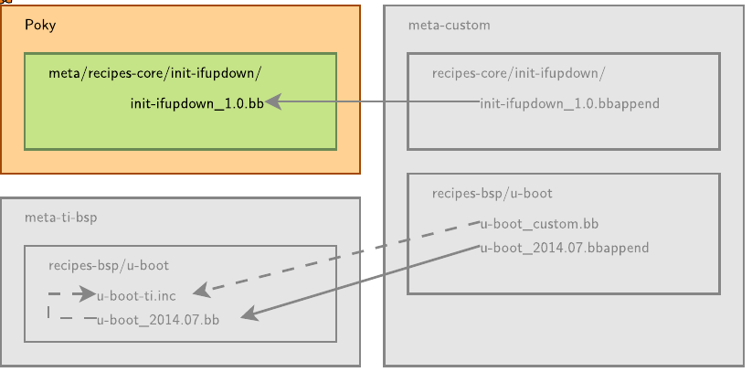
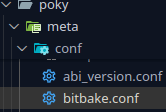
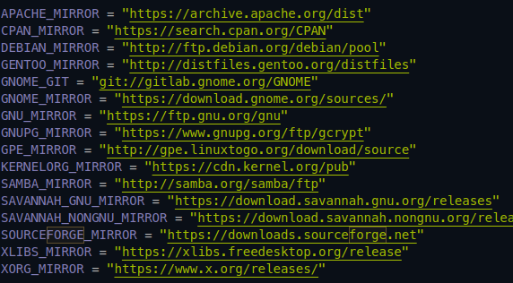
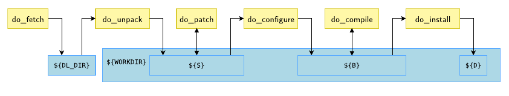
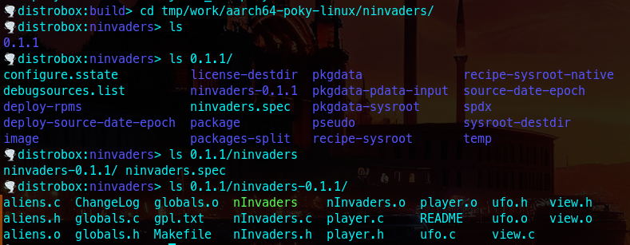

# ders 3 yokoto recepie yazma   
    
reçeteler   
\*\*\*.bb → \*\*\*.bbappend → aynı recipes tarife yapılan ek lere ile olan tarif   
   
`BPN` → Base Package Name   
`PV` → Package Version   
   
`app\_name\_version` →    
   
### Recepie  .inc hazırlarken   
```
poky/meta/conf/bitbake.conf
```
    
hazır değişkenler bulunuyor   
    
   
.inc tek başına kullanılamaz- include yerine kullanılır   
.bb ana recepie derlemenin ana kısmı   
   
**paket.inc**   
`SUMMARY` : short descrition for the package manager
`DESCRIPTION` : describes what the software is about
`HOMEPAGE` : URL to the project’s homepage
`SECTION` : package category (e.g. console/utils)
`LICENSE` : the application’s license, using SPDX identifiers   
`\`SRC\_URI\`` : paketin alınacağı yer,    
  link olabilir   
  dosya konumu olabilir   
    
### derleme sonucu   
```
🌪️ distrobox:build> ls tmp/deploy/rpm/aarch64/ninvaders-
ninvaders-0.1.1-r0.aarch64.rpm      ninvaders-dev-0.1.1-r0.aarch64.rpm  
ninvaders-dbg-0.1.1-r0.aarch64.rpm  ninvaders-src-0.1.1-r0.aarch64.rpm  

```
### temizlemek için   
```
bitbake -c cleanall ninvaders
```
### derlemek için   
```
bitbake -vvv ninvaders # verbose -> her türlü sona kadar dere
```
###    
### ninvade.inc   
```
SUMMARY = "nInvaders is a Space Invaders clone based on ncurses for ASCII output."
HOMEPAGE = "https://ninvaders.sourceforge.net/"
SECTION = "games" # uygulama türü
SRC_URI = "${SOURCEFORGE_MIRROR}/${BPN}/${BPN}-${PV}.tar.gz"
# source forge/ binary paket ismi/ paket versiyonu

CFLAGS += "-fcommon" # gcc eski delemesi ile uyumluluk
EXTRA_OEMAKE = "CC='${CC}' CFLAGS='${CFLAGS}'"
# CC='${CC}' arm'a göre derleme 
do_compile() {
        oe_runmake # open embeded run make
}
do_install() {
        install -d ${D}${bindir}
        install -m 0755 nInvaders ${D}${bindir}
}

```
### ninvade.bb   
```
require ninvaders.inc
LICENSE = "GPLv1"
LIC_FILES_CHKSUM = "file://gpl.txt;md5=393a5ca445f6965873eca0259a17f833" # lisans konumu ve md5 sum değeri
SRC_URI[md5sum] = "97b2c3fb082241ab5c56ab728522622b" # tar md5sum değeri
DEPENDS = "ncurses (>= 5.2)" # bağımlılık ->  readmeden bakıldı

```
   
### derlenen kısımlar   
    
   
