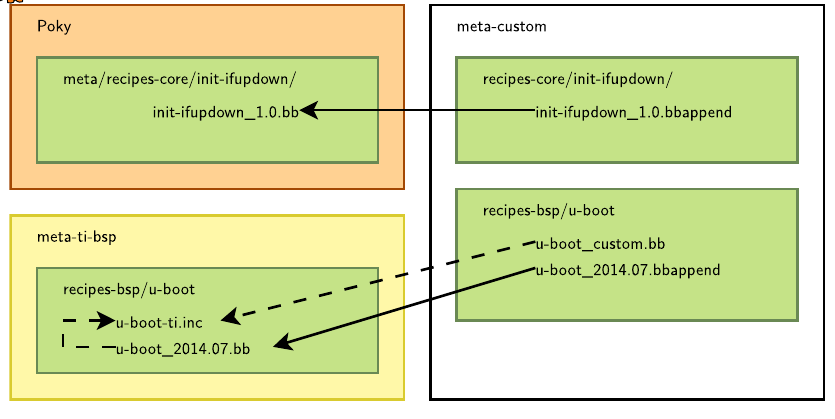
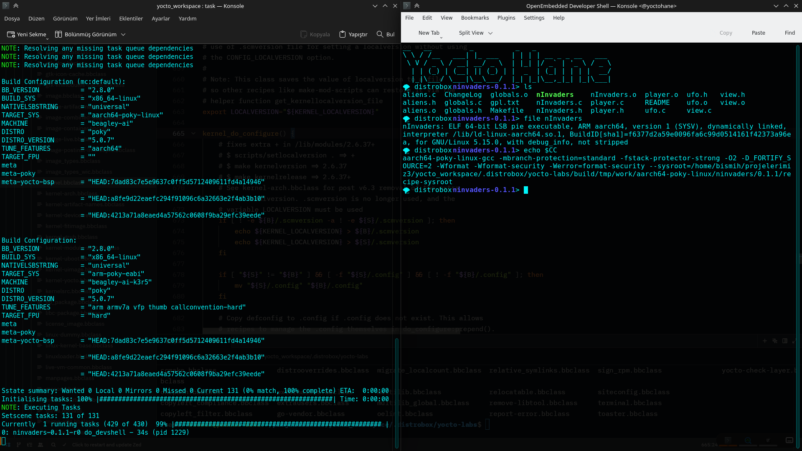
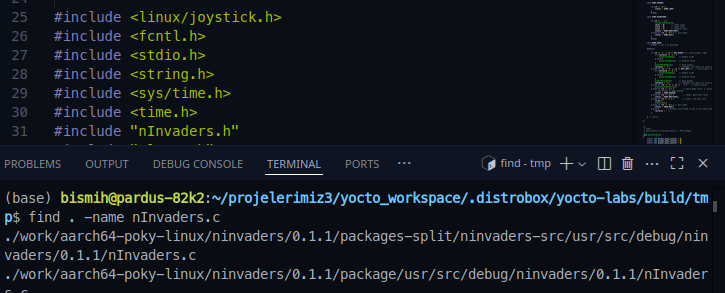

# ders 4-5 tarife ek dosyalar ve layer   
> normale var olan bir tarifi elle değiştirmektense onu kalıtıp değişiklik yapılmakta daha mantıklı   

    
kendi oluşturduğumuz özel bir meta-paketi ile var olan haketin üstüne değişiklik yapma imanı sağlar   
### Dosya tanıtmak için   
```
FILESEXTRAPATHS:prepend := "${THISDIR}/files:"
SRC_URI += "file://defconfig \
file://fix-memory-leak.patch \
"
```
`FILESEXTRAPATHS` → dosyanın olduğu yeri tanımlar   
`inherit` → bbclass kalıtır   
`include` → doysayı direk içeri aktarır   
`require` → doysayı direk içeri aktarır ama yoksa hata verir   
   
### derleme sırasında ortam verme   
```
bitbake -c devshell paket_ismi(ninvaders)

```
    
çalıştırınca tüm ortamı ve ortam değişikleri ile birlikte uç birim veriyor   
   
`bitbake-layers show-layers`    
conf/bbla   
```
layer                 path                     priority
=========================================================
core                  yocto-labs/poky/meta  5
yocto                 yocto-labs/poky/meta-poky  5
yoctobsp              yocto-labs/poky/meta-yocto-bsp  5
meta-arm              yocto-labs/meta-arm/meta-arm  5
arm-toolchain         yocto-labs/meta-arm/meta-arm-toolchain  5
meta-ti-bsp           yocto-labs/meta-ti/meta-ti-bsp  6
meta-beagle           yocto-labs/meta-ti/meta-beagle  6


```
```
🌪 distrobox:build> bitbake-layers show-recipes ninvaders
NOTE: Starting bitbake server...
Loading cache: 100% |####| Time: 0:00:00
Loaded 4028 entries from dependency cache.
=== Matching recipes: ===
ninvaders:
  meta                 0.1.1

```
   
### layer oluşturma   
```
bitbake-layers create-layer -p 7 meta-bootlinlabs
bitbake-layers add-layer meta-bootlinlabs
bitbake-layers show-layers

```
   
`LAYERSERIES\_COMPAT\_meta-bootlinlabs` yoctonun hangi versiyonla kullanılacağı belirtilir   
   
# append ve cofigure işlemleri   
        
```
bitbake-layers show-appends
```
### meta-bootlinlabs içine   
`mkdir -p recipes-kernel/linux/`  oluşturuyoruz    
`linux-bb.org\_git.bbappend` dosyasını oluşturuyoruz. Bu da bizim için linux virtual kısmındaki yere ek ayar yapmayı sağlayacak   
   
> BitBake'de zaten var olan bir tarifi (recipe) değiştirmek istediğinizde, orijinal .bb dosyasını doğrudan düzenlemek yerine .bbappend dosyaları kullanırsınız. Bu, orijinal tarifi bozmadan üzerine ekleme yapmanızı sağlar.   

   
### Tarife ek paketler ekleme   
```
FILESEXTRAPATHS:prepend := "${THISDIR}/files:"
```
normalde tarifte olmayıp ek olarak eklenmesini istediğimiz dosyaları buradan ekleyebiliyoruz.   
   
eklenilen patch'i derlemek için   
```
bitbake virtual/kernel
```
   
`build/conf/local.conf` içinde aşğıdaki tanımladığımız için ninvaders'i tekrar derlemeye gerek yok   
```
IMAGE_INSTALL:append = " ninvaders"
```
   
patch uygulanıp uygulanmadığı için   
```
find . -name nInvaders.c
```
    
   
   
