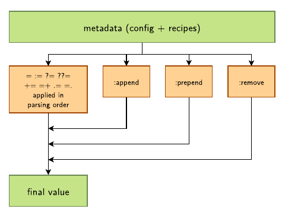
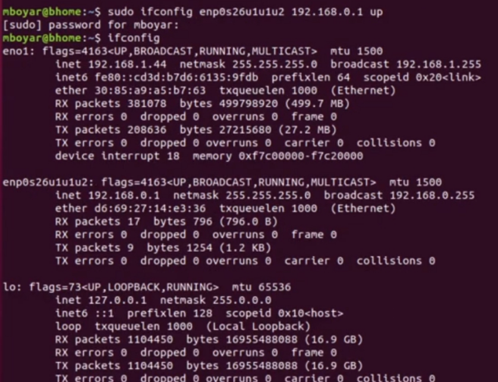

# ders2 özel ayarlamalar   
# Değişken işlemleri   
### atama   
```
COLOUR ?= "unknown" #eğer
```
=   
refransla değişken  ataması   
```
COLOUR = "blue"
SKY = "the sky is ${COLOUR}"
COLOUR = "grey"
PHRASE = "Look, ${SKY}"

# PHRASE = "Look, the sky is grey"
```
:=   
direk değişken ataması   
```
COLOUR = "blue"
SKY := "the sky is ${COLOUR}"
COLOUR = "grey"
PHRASE = "Look, ${SKY}"

# PHRASE = "Look, the sky is blue"
```
    
### Değişken güncelleme   
```
+= append (with space)
=+ prepend (with space)
.= append (without space)
=. prepend (without space)
```
### koşullu durum   
değişkende belli bir parça varsa veya yoksa işlem yapılması   
override içine bakar   
```
OVERRIDES="arm:armv7a:ti-soc:ti33x:beaglebone:poky"
KERNEL_DEVICETREE:beaglebone = "am335x-bone.dtb" # This is applied
KERNEL_DEVICETREE:dra7xx-evm = "dra7-evm.dtb"
# This is ignored
```
### sanal atama   
```
PREFERRED_PROVIDER_virtual/kernel ?= "linux-ti-staging"
PREFERRED_PROVIDER_virtual/libgl = "mesa"
```
   
    
    
